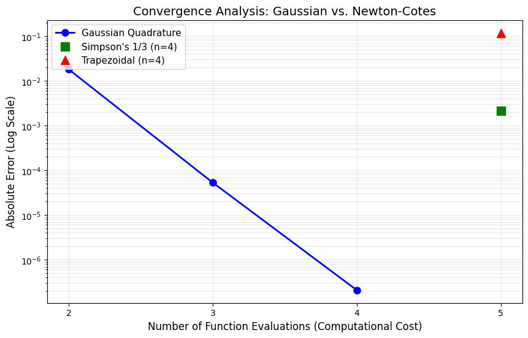

# Numerical Integration using Gaussian Quadrature and Newton-Cotes

This C++ program performs **numerical integration** using two different classes of methods:
1.  **Gaussian Quadrature** (Gauss-Legendre 2, 3, and 4-point)
2.  **Newton-Cotes Formulas** (Trapezoidal Rule & Simpson's 1/3 Rule)

It calculates the definite integral of a function $f(x)$ and compares the accuracy of the Gaussian methods against standard approaches.

## Features

* **Multi-Method:** Implements 2-point, 3-point, and 4-point Gauss-Legendre logic.
* **Benchmarking:** Compares results with Trapezoidal and Simpson's rules.
* **Transformation:** Automatically maps the interval $[a, b]$ to the standard $[-1, 1]$.
* **Error Analysis:** Computes absolute error against the exact analytical solution.
* **Data Export:** Saves the comparison data to `results.csv` for graphing.
* **Precision:** Demonstrates high-order convergence of Gaussian methods.

## Requirements

* **C++ Compiler:** G++ (GNU Compiler Collection) or any standard IDE (VS Code, Code::Blocks).
* **Python (Optional):** Python 3.x with `matplotlib` and `pandas` (required only if you want to regenerate the error plot).

## File Structure

* `main.cpp` - The core C++ source code.
* `plot_graph.py` - Python script to generate the error visualization.
* `results.csv` - Output data generated by the C++ program.
* `error_plot.png` - Visual representation of the convergence.

## How to Run

1.  **Compile the C++ code:**
    ```bash
    g++ main.cpp -o numerical_integration
    ```

2.  **Run the executable:**
    * **Linux / Mac / Git Bash:**
        ```bash
        ./numerical_integration
        ```
    * **Windows (Command Prompt / PowerShell):**
        ```cmd
        numerical_integration.exe
        ```
    *This will print the results table and generate `results.csv`.*

3.  **Generate the Graph (Optional):**
    ```bash
    python plot_graph.py
    ```

## Code Workflow

| Step | Description |
| :--- | :--- |
| **Input** | Defines the integration range $[a, b]$ (Hardcoded as 0 to 1.5). |
| **Transformation** | Maps $[a, b]$ to $[-1, 1]$ using $x = \frac{b-a}{2}t + \frac{b+a}{2}$. |
| **Gaussian Solve** | Computes weighted sum $\sum w_i f(x_i)$ for 2, 3, and 4 points. |
| **Comparison** | Solves using Trapezoidal and Simpson's rules (using $n=4$). |
| **Error Calc** | Calculates $| \text{Exact} - \text{Approx} |$. |
| **Output** | Prints formatted table to console. |
| **Export** | Writes `Method, Error` data to CSV file. |

## Example Output

```text
=== Gaussian Quadrature Project (Group B3) ===
Integrating x*e^x from 0 to 1.5
Exact Integral Value: 2.24084

Method          | Result       | Error
--------------------------------------------------------
Gauss-2         | 2.23846      | 1.822614e-02
Gauss-3         | 2.24083      | 5.342110e-05
Gauss-4         | 2.24084      | 2.103422e-07
Trapezoidal     | 2.12168      | 1.191555e-01
Simpson         | 2.24299      | 2.155500e-03

[Success] Analysis exported to results.csv
```
## Convergence Graph


## Concepts Used

* **Gaussian Quadrature:** Selects optimal nodes and weights to integrate polynomials of degree $2n-1$ exactly.
* **Legendre Polynomials:** The roots of these polynomials determine the sampling points ($x_i$).
* **Newton-Cotes:** Uses equally spaced points (Trapezoidal = linear, Simpson = quadratic approx).
* **Interval Transformation:** Essential for applying standard Gauss weights (defined for $[-1, 1]$) to any general range $[a, b]$.

## 📌 Notes

* The test function used is $f(x) = x e^x$.
* Newton-Cotes methods are set to $n=4$ intervals to match the computational cost of 4-point Gaussian quadrature.
* Simpson's rule requires an even number of intervals.

## Contributors

<a href="https://github.com/username1">
  
</a>
<a href="https://github.com/username2">
  
</a>
<a href="https://github.com/username3">
  
</a>
<a href="https://github.com/username4">
  
</a>
<a href="https://github.com/username5">
  
</a>
<a href="https://github.com/username6">
  
</a>
<a href="https://github.com/username7">
  
</a>
<a href="https://github.com/username8">
  
</a>
<a href="https://github.com/username9">
  
</a>
